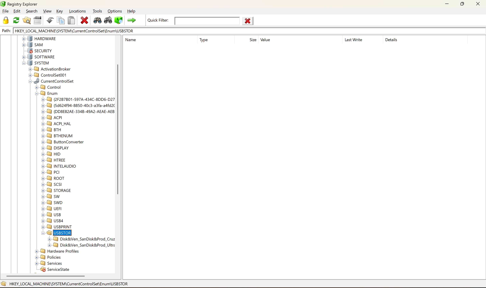
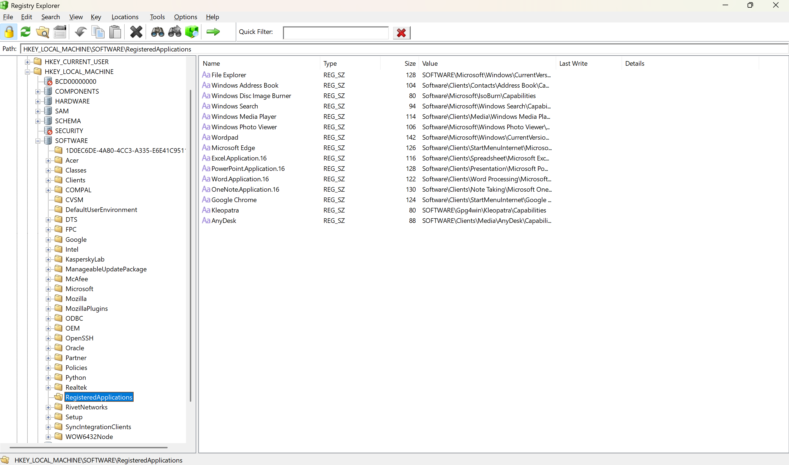

# windows-registry-forensics
Windows Registry Forensics project analyzing key artifacts for user activity, system behavior, and threat detection in digital investigations.
# 🔍 Windows Registry Forensics – Key Artifact Analysis

## 📌 Overview
This project demonstrates the importance of Windows Registry artifacts in **Digital Forensics**.  
The Windows Registry contains valuable information about system activity, user behavior, connected devices, and potential malicious actions.

---

## 🎯 Objectives
- Identify key registry paths used in forensic investigations  
- Understand their forensic significance  
- Analyze system, user, and attacker activity  

---

## 🗂️ Important Registry Paths & Their Use

### 🔌 USB & Device Analysis
- `HKEY_LOCAL_MACHINE\SYSTEM\CurrentControlSet\Enum\USBSTOR`  
  → Shows USB storage devices connected  

- `HKEY_LOCAL_MACHINE\SYSTEM\CurrentControlSet\Enum\USB`  
  → Lists all USB devices (keyboard, mouse, etc.)  

- `HKEY_LOCAL_MACHINE\SYSTEM\MountedDevices`  
  → Provides mounted device details  

---

### 💻 Installed Applications
- `HKEY_LOCAL_MACHINE\SOFTWARE\Registered Applications`  
  → Registered applications list  

- `HKEY_LOCAL_MACHINE\SOFTWARE\Microsoft\Windows\CurrentVersion\Uninstall`  
  → Installed programs  

---

### 👤 User Profiles & Activity
- `HKEY_LOCAL_MACHINE\SOFTWARE\Microsoft\Windows NT\CurrentVersion\ProfileList`  
  → User profiles on system  

- `HKEY_USERS\<USER_SID>\SOFTWARE\Microsoft\Windows\CurrentVersion\Search\RecentApps`  
  → Recently used apps  

- `HKEY_USERS\.DEFAULT\Software\Microsoft\Windows\CurrentVersion\Explorer\User Shell Folders`  
  → Recently accessed document paths  

---

### 🔐 Logon Information
- `HKEY_LOCAL_MACHINE\SOFTWARE\Microsoft\Windows\CurrentVersion\Authentication\LogonUI`  
  → Last logged-in user  

---

### 🌐 Browsing & Execution History
- `HKEY_CURRENT_USER\Software\Microsoft\Internet Explorer\TypedURLs`  
  → Websites visited  

- `HKEY_CURRENT_USER\Software\Microsoft\Windows\CurrentVersion\Explorer\ComDlg32\LastVisitedMRU`  
  → Recently opened files & programs  

- `HKEY_CURRENT_USER\Software\Microsoft\Windows\CurrentVersion\Explorer\RunMRU`  
  → Run command history  

---

### 🚀 Startup & Persistence
- `HKEY_LOCAL_MACHINE\Software\Microsoft\Windows\CurrentVersion\Run`  
- `HKEY_CURRENT_USER\Software\Microsoft\Windows\CurrentVersion\Run`  
  → Startup programs  

- `HKEY_LOCAL_MACHINE\Software\Microsoft\Windows\CurrentVersion\RunOnce`  
  → One-time execution  

---

### ⚠️ Malicious Activity Indicators
- `HKEY_LOCAL_MACHINE\SOFTWARE\Microsoft\Command Processor`  
  → AutoRun can execute malicious commands  

- `HKEY_LOCAL_MACHINE\SOFTWARE\Microsoft\Windows NT\CurrentVersion\Winlogon`  
  → Shell modification = persistence  

---

### 🔑 Privilege Escalation & Security
- `HKEY_LOCAL_MACHINE\SYSTEM\CurrentControlSet\Control\Lsa`  
  → Security policies  

- `HKEY_LOCAL_MACHINE\SYSTEM\CurrentControlSet\Services\Netlogon\Parameters`  
  → Service exploitation  

- `HKEY_LOCAL_MACHINE\SYSTEM\CurrentControlSet\Services\EventLog\Application`  
  → Event log manipulation  

---

### 🧠 Memory & System Behavior
- `HKEY_LOCAL_MACHINE\SYSTEM\CurrentControlSet\Control\Session Manager\Memory Management`  
  → Virtual memory settings  

- `HKEY_LOCAL_MACHINE\SYSTEM\CurrentControlSet\Control\FileSystem`  
  → File system behavior  

---

### 🌍 Network Information
- `HKEY_LOCAL_MACHINE\SYSTEM\CurrentControlSet\Services\Tcpip\Parameters\Interfaces\{GUID}`  
  → Network interfaces  

---

### 🧊 Advanced Attack Indicators
- `HKEY_LOCAL_MACHINE\SYSTEM\CurrentControlSet\Control\hivedef`  
  → Cold boot attack traces  

- `HKEY_LOCAL_MACHINE\SYSTEM\CurrentControlSet\Services`  
  → Suspicious services / LSASS dump  

---

### 🖥️ Hardware Details
- `HKEY_LOCAL_MACHINE\HARDWARE\DESCRIPTION`  
  → Hardware components  

---

## 🛠️ Use Cases
- Incident Response  
- Malware Analysis  
- User Activity Tracking  
- Threat Hunting  
- Evidence Collection  

---

## ⚠️ Disclaimer
This project is for **educational purposes only**.  
Do not use it for unauthorized or illegal activities.

---

## 👩‍💻 Author
**Samriddhi Singh**  
Cybersecurity & Digital Forensics Enthusiast
